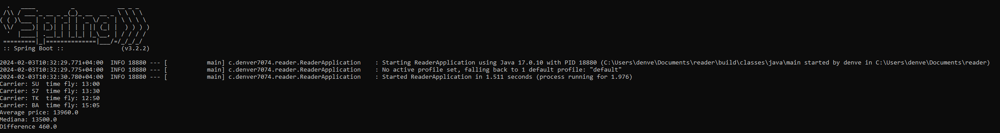
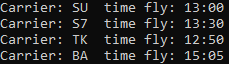

# Тестовое задание "Расчет времени полета"
Напишите программу на языке программирования java, которая прочитает файл tickets.json и рассчитает:

- Минимальное время полета между городами Владивосток и Тель-Авив для каждого авиаперевозчика
- Разницу между средней ценой  и медианой для полета между городами  Владивосток и Тель-Авив

Программа должна вызываться из командной строки Linux, результаты должны быть представлены в текстовом виде. 
В качестве результата нужно прислать ответы на поставленные вопросы и ссылку на исходный код.
## Требование к запуску
- Java 17
- Gradle 8.5
## Запуск программы из командной строки
1. Скачайте репозиторий в нужное место
2. Откройте командную строку и перейдите в репозиторий
```bash
   cd /полный/путь/к/вашему/reader
```
3. Соберите проект следующей командой
```bash
   ./gradlew build
```
4. Запустите проект
```bash
  ./gradlew bootRun
```
## Нюанс решения
Так как время отправления и время пребывания самолетов происходит по местному времени, то необходимо было учитывать часовый пояс каждого города.
## Результат

## Результат времени для каждого авиаперевозчика

## Результат расчета среднего, медиана и их разницы


## Пример входных данных в json файле
```json
{
  "tickets": [{
    "origin": "VVO",
    "origin_name": "Владивосток",
    "destination": "TLV",
    "destination_name": "Тель-Авив",
    "departure_date": "12.05.18",
    "departure_time": "16:20",
    "arrival_date": "12.05.18",
    "arrival_time": "22:10",
    "carrier": "TK",
    "stops": 3,
    "price": 12400
  }, {
    "origin": "VVO",
    "origin_name": "Владивосток",
    "destination": "TLV",
    "destination_name": "Тель-Авив",
    "departure_date": "12.05.18",
    "departure_time": "17:20",
    "arrival_date": "12.05.18",
    "arrival_time": "23:50",
    "carrier": "S7",
    "stops": 1,
    "price": 13100
  },
```


